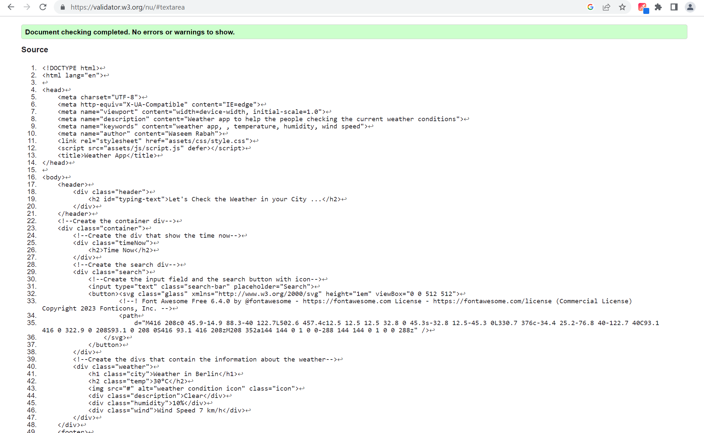
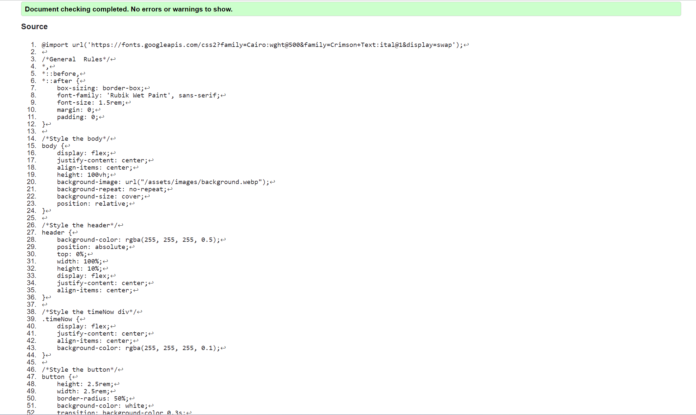
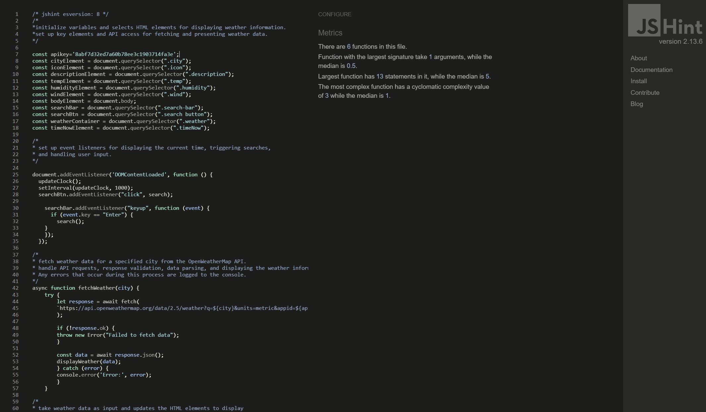
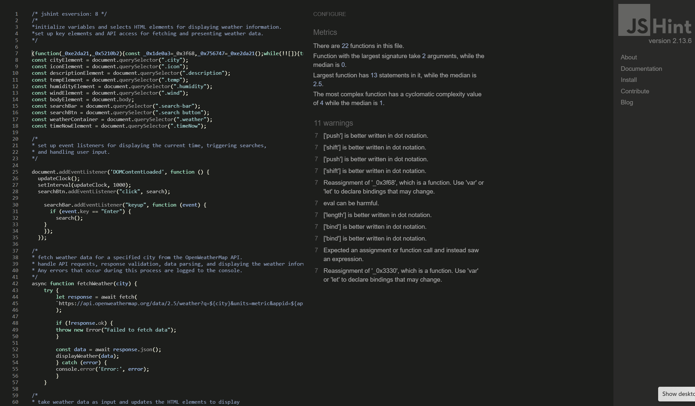
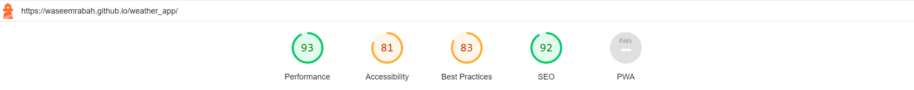
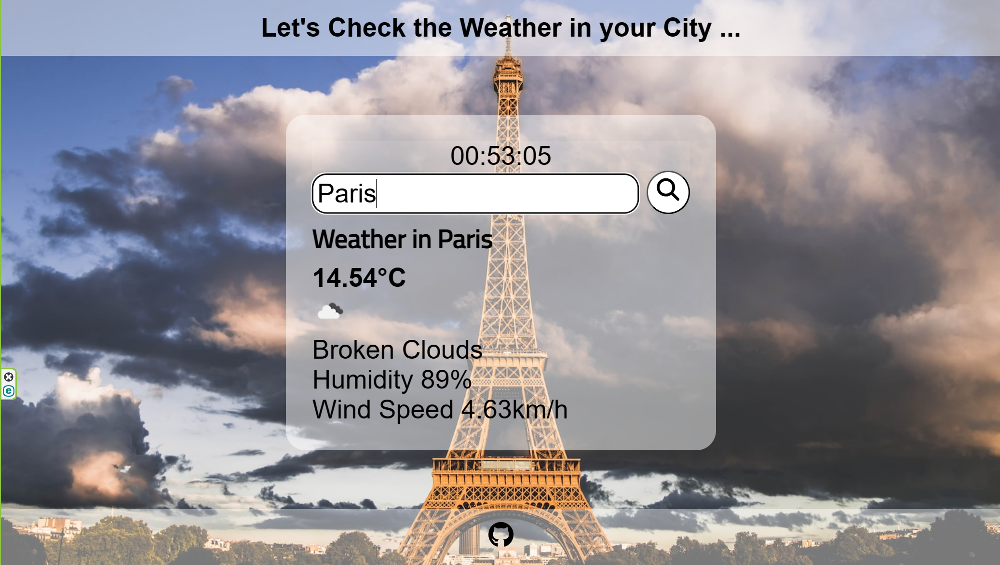
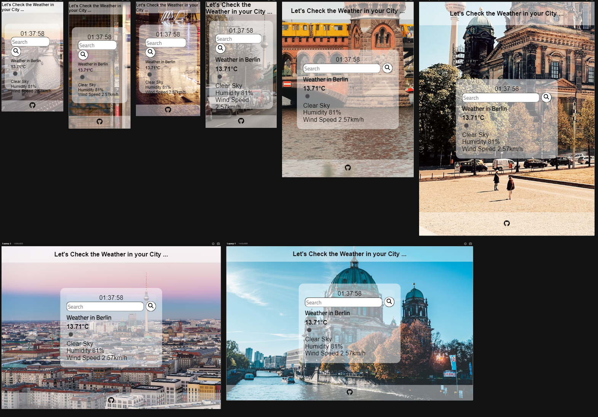

# *Weather App*

The Weather App website display the current weather conditions, including temperature, humidity, wind speed , it also display the local time depending on the user location.

The site can be accessed by this [link](https://waseemrabah.github.io/weather_app/)

---
## User Stories

### First Time Visitor Goals:
* Simple and Intuitive Interface: The app have a clean and user-friendly interface that allows first-time visitors to quickly understand how to navigate and access the desired weather information.
* Current Weather Conditions: Display the current weather conditions prominently on the app's main screen. This includes temperature, weather description (e.g., sunny, cloudy, rainy), and possibly an icon representing the current weather conditions.
* Visualizations and Icons: Utilize visual representations and icons to convey weather conditions more intuitively. 

### Returning VisitorGoals:

* Data Accuracy and Sources: the weather app relies on accurate and reliable weather data sources, providing users with trustworthy information to make informed decisions.
* the app provides real-time weather updates, particularly during rapidly changing weather conditions or severe weather events.
* Enhanced User Engagement: Encourage users to engage with the app.

### Frequent Visitor Goals:

* As a Frequent User, I want to check whether there are any changes with the weather.
* As a Frequent User, I want to know the weather in the city I want to travel to.

---

## Features

- **Real-Time Weather Updates**: Get up-to-date weather information for any city. The app fetches the latest weather data from the OpenWeatherMap API and displays the current temperature, humidity, wind speed, and weather conditions.

- **Search Functionality**: Easily search for weather information for any city around the world. Simply enter the city name in the search bar or press the Enter key to retrieve the weather data.

- **Dynamic Background**: The app dynamically changes the background image based on the searched city. It utilizes the Unsplash API to fetch beautiful images related to the city, providing a visually appealing experience.

- **Responsive Design**: The app is designed to be responsive and adapt to different screen sizes. It ensures a seamless user experience, whether you're accessing it on a desktop, tablet, or mobile device.

- **Typing Animation**: When the page loads, a typing animation is displayed to create an engaging effect. The text gradually appears as if being typed, giving a sense of interactivity to the user.

- **Current Time Display**: The app displays the current time, allowing users to quickly check the time while checking the weather. The clock is automatically updated every second.

- **User-Friendly Interface**: The app features a clean and intuitive interface, making it easy for users to search for weather information and view the displayed data. The search button and search bar are prominently placed for convenience.

- **Weather Icon and Description**: Each city's weather information includes an icon representing the weather conditions and a description providing a brief summary of the weather, such as "Clear," "Cloudy," or "Rainy."

- **Temperature, Humidity, and Wind Speed**: The app provides detailed weather data, including the current temperature in Celsius, humidity percentage, and wind speed in kilometers per hour.

- **Background Image Preloading**: To optimize performance, the app preloads the background images for searched cities. This ensures that the images are loaded quickly and smoothly when displayed.

---

## Usage

1. Enter the name of a city in the search bar.
2. Press the Enter key or click the search button.
3. The app will fetch and display the current weather information for the entered city.
4. Enjoy the real-time weather updates and explore different cities around the world.

---
## Design

### Color Scheme

- White color was used in the header, information container and in the footer with some transparency To make the site simple and easy on the eye.

### Typography

- Cairo Google Font was used as the main font of the website in order to increase readability of the content on the pages.

### Wireframes

- The Wireframes can be accessed by clicking on [Wireframes](documentation/weather_app_wireframes.pdf)

# TESTING

## Manual testing
| Test Case | Description | Expected Result | Actual Result | Pass/Fail |
|-----------|-------------|-----------------|---------------|-----------|
| 1         | Input Search | Enter a valid location in the search field and check if the weather information for that location is displayed correctly. | The website should retrieve and display the accurate weather data for the entered location, including temperature, humidity, and other relevant details. | Pass |
| 2         | Current Weather | Verify that the current weather information is displayed accurately for the user's searched location. | The website should show the current temperature, weather description, humidity, wind speed, and other relevant details. | Pass |
| 3        | Real-Time Clock | Verify that the website displays the current time accurately, synchronized with the user's device time. | The website should show the current time in the user's local time zone and update dynamically without any noticeable delay. | Pass |
| 4         | Responsive Design | Test the website's responsiveness by accessing it on different devices and screen sizes. Ensure that the layout and content adjust correctly and remain usable. | The website should adapt to different screen sizes and maintain a responsive layout without any content or functionality issues. | Pass |
| 5         | Performance | Monitor the website's performance by loading different pages and measuring the load times. Ensure that the pages load quickly and that there are no significant delays or performance issues. | Pages should load within an acceptable timeframe, providing a smooth and responsive user experience. | Pass |
| 10        | GitHub Link | Click on the GitHub link and verify that it leads to my GitHub profile. | The link should open my GitHub profile page in a new tab or window. | Pass |

---

## Validator testing
+ ### HTML
  - No errors or warnings were found when passing through the official W3C validator.

  

+ ### CSS
  - No errors or warnings were found when passing through the official W3C (Jigsaw) validator.

  

+ ### JS
  - No errors or warnings were found when passing through the official [JSHint](https://jshint.com/) validator.
  

  

  - When i used Obfuscator Tool to hide the apikey some errors where found due to the syntax.

  

+ ## LightHouse report

    - Using lighthouse in devtools I confirmed that the website is performing well, accessible and colors and fonts chosen are readable

    

---
In order to confirm the correct functionality, responsiveness, and appearance:

+ The website was tested on the following browsers: Chrome, Firefox, Edge.

    - Chrome:

    

    - FireFox:

    

    - Edge:

    

## Responsiveness

+ The website was checked with [Responsive Viewer Chrome Extention]

---

## Technologies Used

- [HTML](https://developer.mozilla.org/en-US/docs/Web/HTML) was used as the foundation of the site.
- [CSS](https://developer.mozilla.org/en-US/docs/Web/css) - was used to add the styles and layout of the site.
- [CSS Flexbox](https://developer.mozilla.org/en-US/docs/Learn/CSS/CSS_layout/Flexbox) - was used to arrange items simmetrically on the pages.
- [JavaScript](https://developer.mozilla.org/en-US/docs/Web/JAVASCRIPT)- was used to allows the creation of dynamic and interactive elements on webpage.
- [Balsamiq](https://balsamiq.com/) was used to make wireframes for the website.
- [VSCode](https://code.visualstudio.com/) was used as the main tool to write and edit code.
- [Git](https://git-scm.com/) was used for the version control of the website.
- [GitHub](https://github.com/) was used to host the code of the website.

---

## Deployment

- The site was deployed to GitHub pages. The steps to deploy are as follows: 
  - In the [GitHub repository](https://github.com/WaseemRabah/weather_app), navigate to the Settings tab 
  - From the source section drop-down menu, select the **Main** Branch, then click "Save".
  - The page will be automatically refreshed with a detailed ribbon display to indicate the successful deployment.

The live link can be found [here](https://waseemrabah.github.io/weather_app/)

## Local Deployment

In order to make a local copy of this project, you can clone it.
In your IDE Terminal, type the following command to clone my repository:

- `git clone https://github.com/WaseemRabah/weather_app.git`

- Alternatively, if you use Gitpod, you can [click here](https://gitpod.io/#https://github.com/WaseemRabah/weather_app), which will start the Gitpod workspace for you.

---

## Future improvements

- add Additional Weather Data: Expand the range of weather data provided to users. This could include more detailed forecasts, historical weather data, air quality information.
- Localization: Implement localization features to provide weather information in multiple languages or support different date and time formats based on the user's location.
- User Accounts and Preferences: Introduce user accounts to allow users to save their favorite locations, customize their weather preferences, and receive personalized notifications or weather alerts.
- Social Sharing and Integration: Add social sharing capabilities to allow users to share weather information or their favorite weather conditions on social media platforms.

---
## Credits

+ #### Content

  + Understand how to use API key and fetch weather from [Jonah Lawrence](https://www.youtube.com/@DevProTips)

+ #### Media

  - All the images for the website were taken from [Unsplash](https://unsplash.com/).

+ #### Tools

  - [cooler](https://coolors.co/) was used to create the color palette.

  - [VSCode](https://code.visualstudio.com/) was used as the main tool to write and edit code.

  - [GitHub](https://github.com/) was used to host the code of the website.

  - [Openweathermap](https://openweathermap.org/) was used to get the apikey.

  ---

## Acknowledgments
  - [Juliia Konovalova](https://github.com/IuliiaKonovalova) Great supporter and motivator,She was patient and helped me understand how to work with javascript and gave me a lot of valuable advice.
  - [Code Institute](https://codeinstitute.net/) tutors and Slack community members for their support and help.