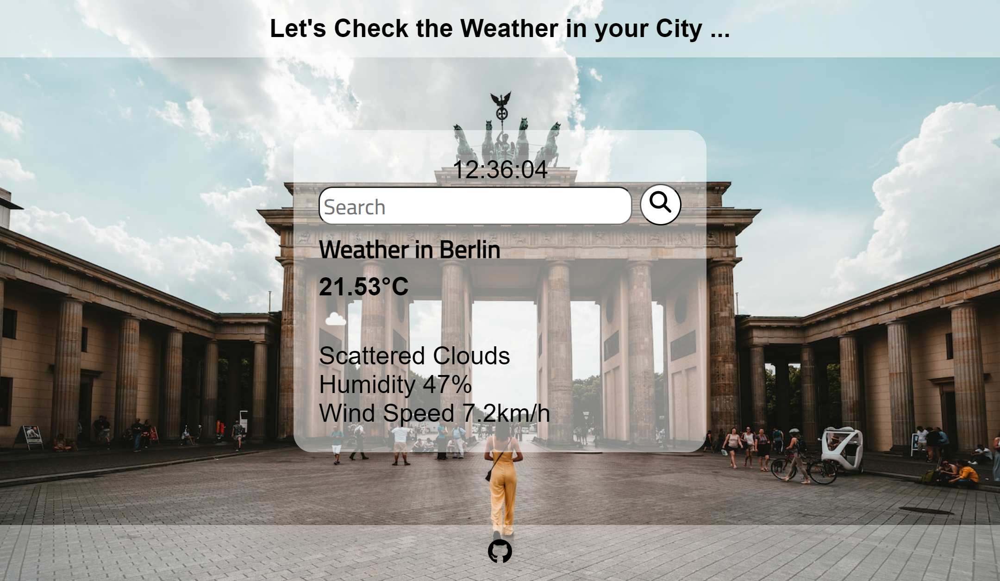
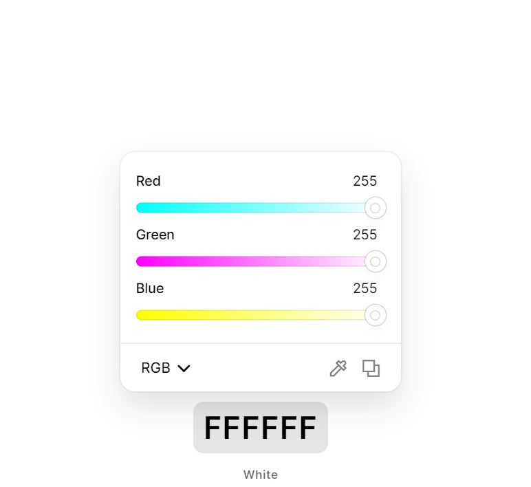
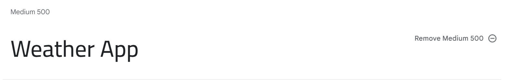
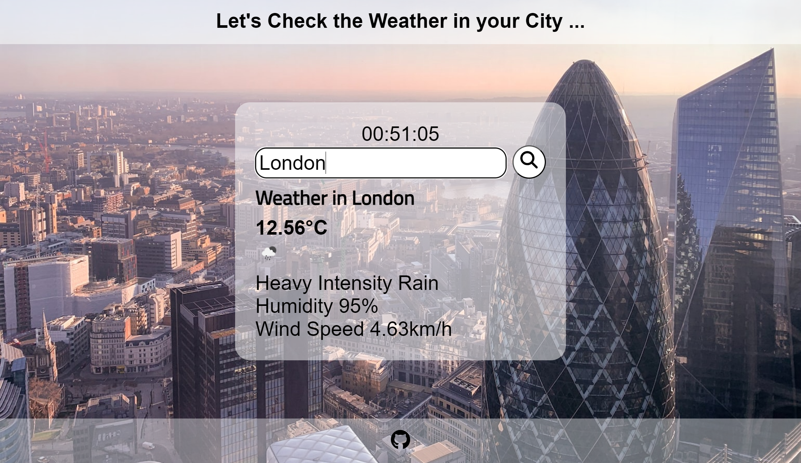
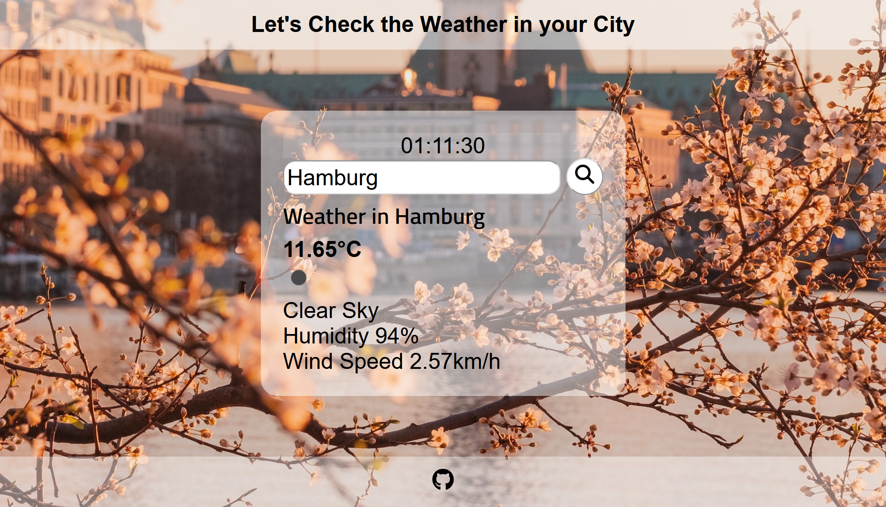

# *Weather App*

The Weather App website display the current weather conditions, including temperature, humidity, wind speed , it also display the local time depending on the user location.

The site can be accessed by this [link](https://waseemrabah.github.io/weather_app/)

---
## User Stories

### First Time Visitor Goals:
* Simple and Intuitive Interface: The app have a clean and user-friendly interface that allows first-time visitors to quickly understand how to navigate and access the desired weather information.
* Current Weather Conditions: Display the current weather conditions prominently on the app's main screen. This includes temperature, weather description (e.g., sunny, cloudy, rainy), and possibly an icon representing the current weather conditions.
* Visualizations and Icons: Utilize visual representations and icons to convey weather conditions more intuitively. 

### Returning VisitorGoals:

* Data Accuracy and Sources: the weather app relies on accurate and reliable weather data sources, providing users with trustworthy information to make informed decisions.
* the app provides real-time weather updates, particularly during rapidly changing weather conditions or severe weather events.
* Enhanced User Engagement: Encourage users to engage with the app.

### Frequent Visitor Goals:

* As a Frequent User, I want to check whether there are any changes with the weather.
* As a Frequent User, I want to know the weather in the city I want to travel to.

---
## Design

### Color Scheme

- White color was used in the header, information container and in the footer with some transparency To make the site simple and easy on the eye.

### Typography

- Cairo Google Font was used as the main font of the website in order to increase readability of the content on the pages.

### Wireframes

- The Wireframes can be accessed by clicking on [Wireframes](documentation/weather_app_wireframes.pdf)

# TESTING

In order to confirm the correct functionality, responsiveness, and appearance:

+ The website was tested on the following browsers: Chrome, Firefox, Edge.

    - Chrome:

    

    - FireFox:

    

    -Edge:

    [Edge](documentation/testing_edge.png)
